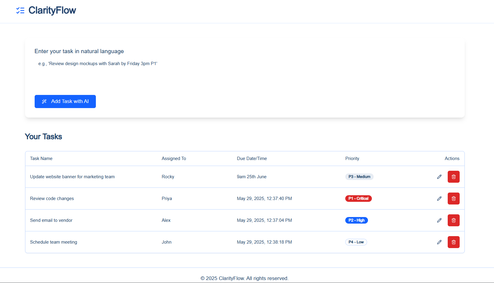

# ClarityFlow

ClarityFlow is an AI-powered task management application designed to help you easily add and manage your tasks. It allows you to enter tasks in natural language and leverages AI to extract details and add them to your task list.



## Features

*   **Natural Language Task Input:** Easily add tasks by typing in natural language descriptions.
*   **AI-Powered Detail Extraction:** AI automatically extracts key information like task name, assignee, due date/time, and priority.
*   **Task Listing:** View your tasks in a clear, organized table.
*   **Task Editing:** Modify existing task details.
*   **Task Deletion:** Remove tasks you no longer need.

## Setup

To run this project locally, you will need Node.js (version 18 or later) and a package manager like npm, yarn, or pnpm installed.

1.  **Clone the repository:**
    ```bash
    git clone https://github.com/haarry9/Natural-Language-Task-Manager.git
    cd Natural-Language-Task-Manager
    ```

2.  **Install dependencies:**
    ```bash
    npm install
   
    ```

3.  **API Configuration:**
    This project utilizes AI capabilities, which may require API keys or credentials. Create a `.env.local` file in the root of the project and add your API keys as environment variables. Refer to the application's code (e.g., files in the `src/ai` directory) to identify the necessary environment variables (e.g., `GENKIT_API_KEY`, `GOOGLE_API_KEY`, etc.) and their required format.

    ```env
    GENKIT_API_KEY=your_genkit_api_key_here
    ```

## Running Locally

To start the development server, run the following command:

```bash
npm run dev
```

The application will be accessible at `http://localhost:3000` (or the port specified in your project configuration).


